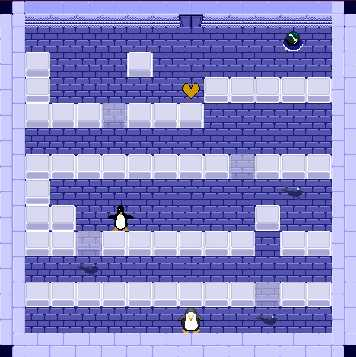

## Pengolo

Pengolo is a sokoban style block-pushing game that harkens back to classic NES games like "Pengo" and "Adventures of Lolo." 
You control a penguin who pushes cubes of ice,  collect fish, and avoid the angry enemy penguins to navigate through the level.

### Controls
Mouse & keyboard  (**Arrow keys** or **WASD**) are required for gameplay 
(**Esc**) - Escape will to return to main level.

### Credits
Created over three weeks in January 2022  for an independent study at UW-Stout on implementing game programming - directed by Professor Michael Tetzlaff.
2D Game by Karl Koehle Copyright - 2021

All art assets, programming, and audio recordings were created by Karl Koehle,
Image copyright - Karl Koehle - All rights reserved  2022

Tools used: Aseprite, Unity.  Music composed using "Beepbox.co"
